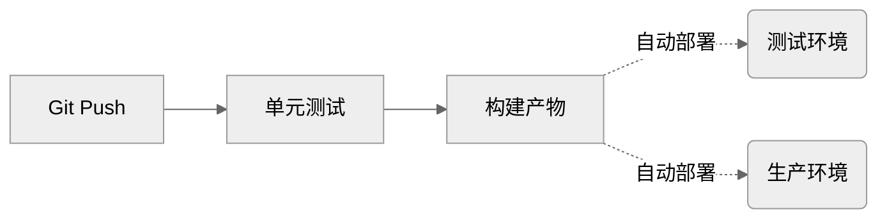
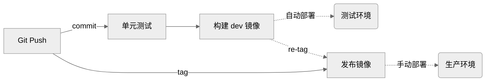

::toc

# 什么是 CICD

`CICD` 的中文翻译是 **持续集成，持续部署**，简单来说就是在程序员们每天不断的合并代码时，有一个系统可以自动对合入的代码进行各种测试，以保证合入代码没有对服务造成破坏，然后自动化地构建产物（比如 Docker 镜像、编译后的二进制执行文件），并完成自动化部署等等。

一个比较有名的 CICD 系统是 `Jenkins`，它通过 Pipeline 定义工作流，也可以直接使用任务模板，强大又灵活。 Jenkins 通常需要开发者自行部署到服务器，所以它是一种本地 CICD 方案。

因此也有一些专门做云上 CICD 的平台，比如 [`Travis CI`](https://www.travis-ci.com/)、[`AppVeyor`](https://www.appveyor.com/) 等。我们要介绍的 `Github Workflow` 也是一种云上 CICD 平台，它最大的优势是天然的和 Github 绑定，可以非常方便地使用他人开发的 `Github Actions`。

# 一个简单的 Workflow

```yaml title=".github/workflows/build.yaml" {14-17}
name: Build frontend
on: [push]
jobs:
  build:
    runs-on: ubuntu-latest
    steps:
      - uses: actions/checkout@v4

      # 安装 node.js
      - uses: actions/setup-node@v4
        with:
          node-version: 18

      # 构建
      - run: |
          npm i
          npm build

      # 将 ./dist 产物上传到服务器
      # ...
```

只需要将这个文件放到 Github 仓库中，它就会在每次主分支有提交时运行，还可以在 `Actions` 选项卡看到运行情况：


本文不是 Github Workflow 的使用教程，所以不再介绍基本的使用方法，可以到[官网](https://docs.github.com/en/actions/using-workflows)查看完整的教程。

# CICD 设计思路

为一个双环境系统设计一套 CICD，双环境是指有一个 `Production` 线上生产环境，还有一个 `Testing` 测试环境。这套 CICD 的大致流程如下：



每个代码仓库有且仅有一个主分支，主分支对应 Testing 环境，当 Git 推送 commit 或合并 PR 时，自动进行单元测试、镜像构建，并最终发布到 Testing 环境。当 Git 推送 tag 时，构建的产物将会自动部署的 Production 环境。

这里的构建产物虽然可以是前端的 `dist` 文件，或者后端的 `bin` 可执行文件，但更好的方法是通过镜像和容器来管理我们的服务，通过镜像版本来管理我们的服务版本。对于产物是镜像的服务，它的一个简单 CICD 流程可以如下：



注意这里的 dev 镜像版本可以是 `commit sha`，如 `server:411f38c`。推送 tag 时，根据 tag 对应的 `commit sha` 拉取之前构建好的镜像，并重新打上标签，如 `server:1.0.0`，并最终手动部署到 Production 环境。

# CICD on Github Workflow

由于 Github Workflow 设计上的灵活性，我们可以每部分拆解来看实现方式。

## 自动化测试

```yaml title=".github/workflows/test.yaml" {24-26}
name: Unit Testing

on:
  push:
    branches: [main, master] # 推送到分支时运行

jobs:
  build:
    runs-on: ubuntu-20.04
    steps:
      # 在 Action 运行环境中拉取当前仓库的代码
      - name: Checkout
        uses: actions/checkout@v3

      # 执行实际的测试代码，如执行 go 语言单元测试
      # 这里只是最简单的示例代码，实际要根据情况配置依赖
      # 如 private modules 权限、动态生成的如 protobuf 文件、cache 等

      # 安装 go
      - uses: actions/setup-go@v3
        with:
          go-version: 1.19.x

      # 运行单元测试
      - run: |
          go test -race -failfast -count=1 -gcflags=all=-l ./...
```

## 自动化构建

```yaml title=".github/workflows/build.yaml" {19-26} {47-54}
name: Build Image

on:
  push:
    branches: [main, master] # 推送到分支时运行

concurrency: # 限制 Build Workflow 不并发
  group: build-${{ github.sha }}

env:
  # 根据实际情况配置你的 image hub
  REGISTRY: YOUR_REGISTRY
  REPO_NAME: YOUR_REPO

jobs:
  build:
    runs-on: ubuntu-20.04
    steps:
      # 截取 github.sha 变量的前 7 位作为镜像版本
      - id: get_version
        name: Get image version
        run: |
          IMAGE_VERSION=${{ github.sha }}
          IMAGE_VERSION=${IMAGE_VERSION: 0: 7}
          echo ${IMAGE_VERSION}
          echo "IMAGE_VERSION=${IMAGE_VERSION}" >> $GITHUB_ENV

      # 在 Action 运行环境中拉取当前仓库的代码
      - name: Checkout
        uses: actions/checkout@v3

      # 安装 Docker Build 工具包
      - name: Set up QEMU
        uses: docker/setup-qemu-action@v2

      - name: Set up Docker Buildx
        uses: docker/setup-buildx-action@v2

      # 登录到 Docker Hub
      - name: Login to Docker Hub
        uses: docker/login-action@v2
        with:
          registry: ${{ env.REGISTRY }}
          username: ${{ secrets.REGISTRY_USER }}
          password: ${{ secrets.REGISTRY_PASSWORD }}

      # 使用 ./Dockerfile 编译、打包并推送
      - name: Build and push
        uses: docker/build-push-action@v3
        with:
          context: .
          build-args: VERSION=${{ env.IMAGE_VERSION }}
          push: true
          tags: ${{ env.REGISTRY }}/${{ env.REPO_NAME }}:${{ env.IMAGE_VERSION }}
```

代码仓库下需要添加一个 Dockerfile 文件，来编写服务编译脚本，例如一个简单的前端服务：

```dockerfile title="Dockerfile"
FROM node:18-alpine as builder

ADD . /app
WORKDIR /app

RUN npm i && npm build

# Copy distribution to a clean stage
FROM node:18-alpine

COPY --from=builder /app/dist /app/

ENV HOST 0.0.0.0
EXPOSE 8080

ENTRYPOINT ["node", "/app/index.js"]
```

## 自动化部署

一个最简单的使用 SSH 登录到服务器，并执行升级服务脚本的 Workflow：

```yaml title=".github/workflows/deploy.yaml" {31}
name: Deploy

on:
  # 支持手动部署
  workflow_dispatch:
    inputs:
      service:
        description: "The service you want to deploy"
        required: true
        type: string
      version:
        description: "The service version you want to deploy"
        required: true
        type: string

jobs:
  deploy:
    runs-on: ubuntu-20.04
    steps:
      # 使用 SSH 登录到服务器
      - name: Deploy ${{ inputs.service }}@${{ inputs.version }}
        uses: appleboy/ssh-action@v0.1.10
        with:
          host: ${{ secrets.SSH_HOST }}
          username: ${{ secrets.SSH_USER }}
          key: ${{ secrets.SSH_KEY }}
          port: ${{ secrets.SSH_PORT }}
          script_stop: true
          # 执行实际的部署脚本，如部署 docker service
          script: |
            sudo docker service update --image ${{ inputs.version }} ${{ inputs.service }}
```

> 关于 Docker Service 的教程可以参考[我的这篇文章](/posts/docker-swarm-deploy)。

当然实际情况肯定比这个要复杂，我们可以一步一步解决实际可能遇到的问题。

## 管理配置文件

服务升级肯定不只是升级服务的程序，还要考虑它需要的配置文件，以及不同环境如何使用不同的配置文件。

如果你使用 `k8s` 管理服务，那么你不需要关注这个章节，因为 `ConfigMap` 已经替你做了大部分工作。

如果你使用 Github 仓库来管理配置文件，那么可以给服务器安装 Git，通过 `git pull` 拉取最新的配置文件，例如：

```yaml title=".github/workflows/deploy.yaml" {9-11}
steps:
  # 使用 SSH 登录到服务器
  - name: Deploy
    uses: appleboy/ssh-action@v0.1.10
    with:
      script: |
        cd /path/to/your/repo
        # 拉取最新配置
        git fetch
        git reset --hard ${{ github.sha }}
        git clean -xdf
        # 执行实际的部署脚本
        sudo docker service update --image ${{ inputs.version }} ${{ inputs.service }}
```

然而这需要服务器具有访问你的 Github Repo 的权限，并且同一仓库下具有多个服务时，`git pull` 会更新到其他原本不想更新的文件，还会出现并发问题导致部署失败。

所以一个更好的方法是使用 `Docker Config` 管理配置文件，它可以将配置文件标记版本号，以便将镜像版本和配置文件版本绑定起来更新。关于 Docker Config 的使用方法可以参考[我的这篇文章](/posts/docker-swarm-service-config)。

另外还可以使用其他存储服务（如 `OSS`）来代替本地 `git pull` 的方式更新配置文件，当配置文件更新时自动推送到 OSS，然后在服务器挂载 OSS 到本地目录即可。这样服务器只需要有 OSS 的访问权限即可，这在同一个云服务商下很容易做到，而且更利于扩容。

一个自动推送配置文件到 OSS 的 Workflow：

```yaml title=".github/workflows/upload.yaml" {23}
name: Upload manifests
on:
  workflow_dispatch:

jobs:
  upload:
    runs-on: ubuntu-latest
    steps:
      - uses: actions/checkout@v1

      - name: Setup OSS
        uses: manyuanrong/setup-ossutil@v3.0
        with:
          endpoint: YOUR_OSS_ENDPOINT.aliyuncs.com
          access-key-id: ${{ secrets.ALIYUN_KEY }}
          access-key-secret: ${{ secrets.ALIYUN_SECRET }}

      - name: Upload to OSS
        run: |
          # clear uploads
          rm -rf ./.git
          # upload to oss
          ossutil sync ./ oss://YOUR_OSS_BUCKET/ --force --update --delete
```

## 支持回滚重启等操作

写一个 `service.sh` 脚本，根据不同的参数执行不同的操作，例如：

```sh title="service.sh"
#!/bin/bash
set -e

SERVICE="$1"
LOCK_FILE="/tmp/deploy-$SERVICE.lock"
[[ ${FLOCKER} != "$0" ]] && exec env FLOCKER="$0" flock -x -w 10 "$LOCK_FILE" "$0" "$@" || :

function deploy() {
  docker stack deploy -c docker-compose.yaml --with-registry-auth ${SERVICE}-stack
}

function restart() {
  docker service update --quiet --force "$service"
}

function rollback() {
  docker service rollback --quiet "$service"
}

case "$2" in
    deploy)
        deploy
        ;;
    restart)
        restart
        ;;
    rollback)
        rollback
        ;;
    *)
        echo "Usage: $0 {deploy|restart|rollback}"
        exit 1
esac
```

使用方法：

```bash
# 部署
./service.sh YOUR_SERVICE deploy

# 重启
./service.sh YOUR_SERVICE restart

# 回滚
./service.sh YOUR_SERVICE rollback
```

然后在 Workflow 中使用 SSH 登录到服务器上执行这个脚本即可：

```yaml title=".github/workflows/deploy.yaml" {11-19} {28-29}
name: Deploy

on:
  # 支持手动部署
  workflow_dispatch:
    inputs:
      service:
        description: "The service you want to deploy"
        required: true
        type: string
      operation:
        description: "The operation you want to perform"
        required: true
        default: "deploy"
        type: choice
        options:
          - deploy
          - rollback
          - restart

    steps:
      # 使用 SSH 登录到服务器
      - name: Deploy
        uses: appleboy/ssh-action@v0.1.10
        with:
          script: |
            cd /path/to/your/repo
            chmod u+x ./service.sh
            exec ./service.sh ${{ inputs.service }} ${{ inputs.operation }}
```

## 多环境部署

Testing 环境往往部署在单独的服务器，只需要根据环境选择 SSH 登录到不同服务器即可。

```yaml title=".github/workflows/deploy.yaml" {7-14} {32-35}
name: Deploy

on:
  # 支持手动部署
  workflow_dispatch:
    inputs:
      env:
        description: "The environment you want to deploy"
        required: true
        default: "testing"
        type: choice
        options:
          - product
          - testing
      service:
        description: "The service you want to deploy"
        required: true
        type: string
      version:
        description: "The service version you want to deploy"
        required: true
        type: string

jobs:
  deploy:
    runs-on: ubuntu-20.04
    steps:
      # 使用 SSH 登录到服务器
      - name: Deploy ${{ inputs.service }}@${{ inputs.version }}
        uses: appleboy/ssh-action@v0.1.10
        with:
          host: ${{ inputs.env == 'product' && secrets.SSH_HOST || secrets.TESTING_SSH_HOST }}
          username: ${{ inputs.env == 'product' && secrets.SSH_USER || secrets.TESTING_SSH_USER }}
          key: ${{ inputs.env == 'product' && secrets.SSH_KEY || secrets.TESTING_SSH_KEY }}
          port: ${{ inputs.env == 'product' && secrets.SSH_PORT || secrets.TESTING_SSH_PORT }}
          script_stop: true
          # 执行实际的部署脚本，如部署 docker service
          script: |
            sudo docker service update --image ${{ inputs.version }} ${{ inputs.service }}
```

## Workflow 重用

有多个服务需要管理时，如果每个服务的部署脚本相同还好，用上面的 Workflow 传入不同的 service 就可以了。

但如果有些服务的部署流程比较特殊，必须单独为每个服务编写一个脚本来执行部署、回滚操作的话，每个 Workflow 都写这么冗长就有些难以维护了，这就要用到 Workflow 的 **重用** 功能了。

重用就是用类似函数调用的方式去调用一个 Workflow，也就是 Workflow 的封装。

可以这样将 SSH 登录执行和服务独立配置分割开：

```yaml title=".github/workflows/deploy_server.yaml" {17}
name: Deploy Server

on:
  workflow_dispatch:
    inputs:
      env:
        description: "The environment you want to deploy"
        required: true
        default: "testing"
        type: choice
        options:
          - product
          - testing

jobs:
  deploy:
    uses: ./.github/workflows/deploy.yaml
    secrets: inherit
    with:
      env: ${{ inputs.env || (github.ref_name == 'master' && 'testing' || github.ref_name) }}
      dir: /path/to/your/server
      operation: ${{ inputs.operation }}
```

```yaml title=".github/workflows/deploy.yaml" {4} {34-36}
name: Deploy

on:
  workflow_call:
    inputs:
      env:
        description: "Deploy environment"
        type: string
        required: true
      dir:
        description: "Working directory"
        type: string
        required: true
      operation:
        type: string
        required: false
        default: deploy

jobs:
  deploy:
    runs-on: ubuntu-20.04
    steps:
      # 使用 SSH 登录到服务器
      - name: Deploy
        uses: appleboy/ssh-action@v0.1.10
        with:
          host: ${{ inputs.env == 'product' && secrets.SSH_HOST || secrets.TESTING_SSH_HOST }}
          username: ${{ inputs.env == 'product' && secrets.SSH_USER || secrets.TESTING_SSH_USER }}
          key: ${{ inputs.env == 'product' && secrets.SSH_KEY || secrets.TESTING_SSH_KEY }}
          port: ${{ inputs.env == 'product' && secrets.SSH_PORT || secrets.TESTING_SSH_PORT }}
          script_stop: true
          # 执行实际的部署脚本，如部署 docker service
          script: |
            cd ${{ inputs.dir }}
            chmod u+x ./service.sh
            exec ./service.sh ${{ inputs.operation }}
```

## 构建后自动部署

想要实现构建后自动部署到 Testing 环境，如果所有 Workflow 都在同一个仓库下，那直接重用即可。

如果不再同一个仓库下，可以用 `repository_dispatch` 的方式调用另一个仓库下的 Workflow。

被调用仓库的 Workflow：

```yaml title=".github/workflows/deploy.yaml" {4-5}
name: Deploy

on:
  repository_dispatch:
    types: [deploy_service]
# ...
```

构建产物的 Workflow：

```yaml title=".github/workflows/build.yaml" {11-28}
name: Build

on:
  push:
    branches: [main, master]

jobs:
  build:
    # ...

  deploy:
    runs-on: ubuntu-latest
    needs: [build] # 依赖 build 任务完成
    steps:
      - name: Notify
        uses: actions/github-script@v7
        with:
          # 需要配置 PAT 以获取另外一个仓库的权限
          github-token: ${{ secrets.PENSONAL_ACCESS_TOKEN }}
          # 调用 Github API 发送 repository_dispatch 事件
          # see syntax on https://octokit.github.io/rest.js/v20
          script: |
            await github.rest.repos.createDispatchEvent({
              owner: 'YOUR_DEPLOY_REPO_OWNER',
              repo: 'YOUR_DEPLOY_REPO_NAME',
              event_type: 'deploy_service',
              client_payload: {},
            });
```

## 部署后周知工作群

[`github-script`](https://github.com/actions/github-script) 这个 Action 可以执行 js 代码，那我们就可以用支持 API 的群机器人来发送通知。

例如，下面的代码发送通知到 Lark 群：

```yaml title=".github/workflows/notify.yaml" {27-28}
on:
  workflow_dispatch:
    inputs:
      service:
        description: "Repo owner"
        type: string
        required: true
      tag_name:
        description: "Tag name"
        default: v1.x.x
        type: string
        required: true
      message:
        description: "Message"
        type: string

jobs:
  notify:
    runs-on: ubuntu-latest
    steps:
      - uses: actions/checkout@v3

      - name: Notify to Lark
        uses: actions/github-script@v7
        with:
          script: |
            const script = require('./.github/workflows/scripts/send_lark_card.js')
            await script({github, context, core})
        env:
          APP_ID: ${{ secrets.LARK_APP_ID }}
          APP_SECRET: ${{ secrets.LARK_APP_SECRET }}
          RECEIVE_TYPE: chat_id
          RECEIVE_ID: ${{ vars.LARK_NOTIFY_ID }}
          # Build Lark Card on https://open.feishu.cn/tool/cardbuilder
          CARD_BODY: |
            {
              "config": {
                "wide_screen_mode": true
              },
              "header": {
                "template": "blue",
                "title": {
                  "content": "【CICD】${{ inputs.service }} 服务构建通知",
                  "tag": "plain_text"
                }
              },
              "elements": [
                {
                  "fields": [
                    {
                      "is_short": true,
                      "text": {
                        "content": "**版本**\n${{ inputs.tag_name }}",
                        "tag": "lark_md"
                      }
                    },
                    {
                      "is_short": true,
                      "text": {
                        "content": "**操作人**\n${{ github.actor }}",
                        "tag": "lark_md"
                      }
                    }
                  ],
                  "tag": "div"
                },
                {
                  "tag": "div",
                  "text": {
                    "content": ${{ inputs.message }},
                    "tag": "lark_md"
                  }
                }
              ]
            }
```

这个 Workflow 会通过 Lark 机器人发送一张消息卡片，发送消息的代码如下：

```javascript title=".github/workflows/scripts/send_lark_card.js"
module.exports = async ({ github, context, core }) => {
  const { APP_ID, APP_SECRET, RECEIVE_TYPE, RECEIVE_ID, CARD_BODY } = process.env;

  // Get app access token
  const { tenant_access_token } = await fetch("https://open.feishu.cn/open-apis/auth/v3/tenant_access_token/internal", {
    method: "POST",
    headers: { "Content-Type": "application/json" },
    body: JSON.stringify({
      app_id: APP_ID,
      app_secret: APP_SECRET,
    }),
  }).then(async response => {
    if (!response.ok) {
      throw new Error(`HTTP error! Status: ${response.status}. Message: ${await response.text()}`);
    }
    return response.json();
  });

  // Send card
  await fetch(`https://open.feishu.cn/open-apis/im/v1/messages?receive_id_type=${RECEIVE_TYPE}`, {
    method: "POST",
    headers: {
      "Content-Type": "application/json",
      Authorization: `Bearer ${tenant_access_token}`,
    },
    body: JSON.stringify({
      receive_id: RECEIVE_ID,
      content: CARD_BODY,
      msg_type: "interactive",
    }),
  }).then(async response => {
    if (!response.ok) {
      throw new Error(`HTTP error! Status: ${response.status}. Message: ${await response.text()}`);
    }
    return response.json();
  });
};
```

当然卡片也可以在 Workflow 中通过变量做一些美化，测试效果：


